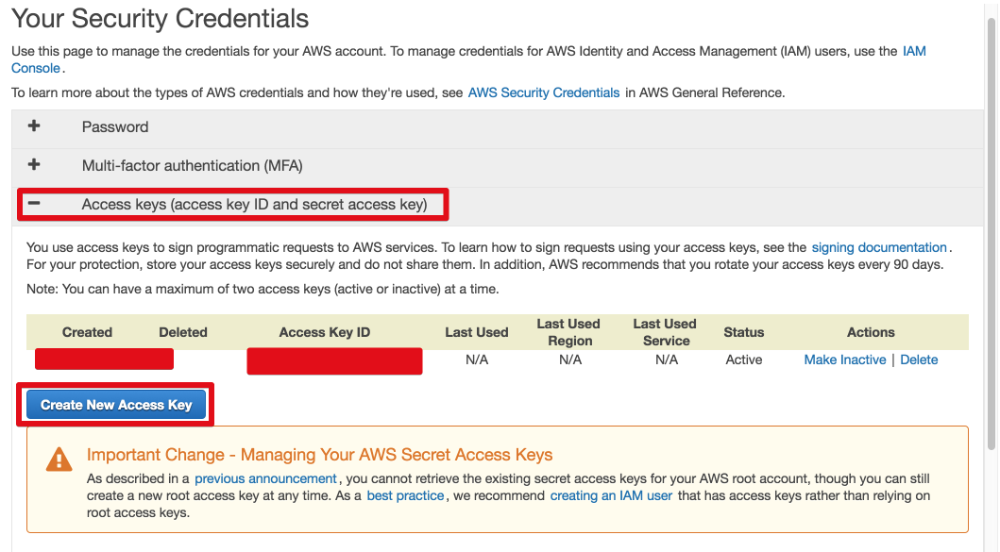

# 초보개발자 모임 Mail 모듈

### AWS SES 설정시 주의사항

SMTP credentials을 사용하는것이 아닌, 글로벌 credentials이 필요합니다.  
[https://console.aws.amazon.com/iam/home?#/security_credential](https://console.aws.amazon.com/iam/home?#/security_credential)에 접속하여 **Create New Access Key**를 진행하세요 



받은 access key와 password를 ```~/.aws/credentials``` 파일을 생성하여 아래의 코드에 값을 채워 추가하세요

```bash
[default]
aws_access_key_id=
aws_secret_access_key=
```

## 참고

* [AWS SES JAVA SDK Sample](https://github.com/aws/aws-sdk-java/blob/master/src/samples/AmazonSimpleEmailService/AmazonSESSample.java) 
* [Dependency](https://search.maven.org/#artifactdetails%7Ccom.amazonaws%7Caws-java-sdk-ses%7C1.11.227%7Cjar)